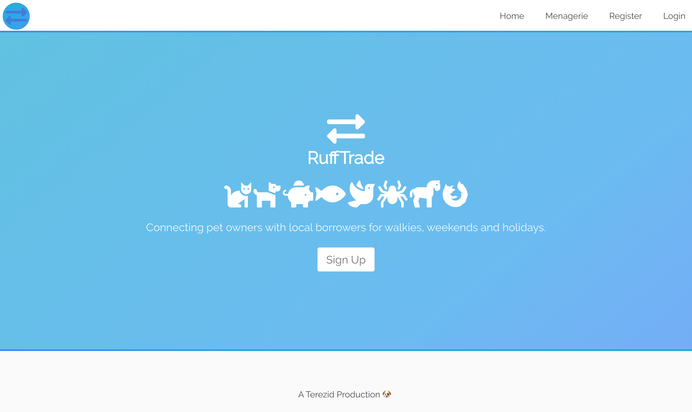
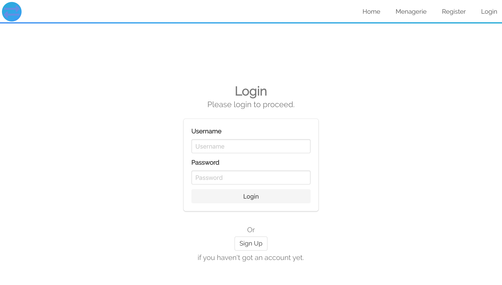
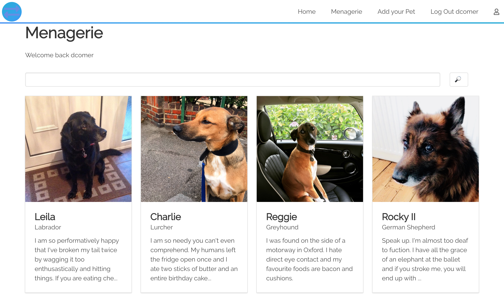
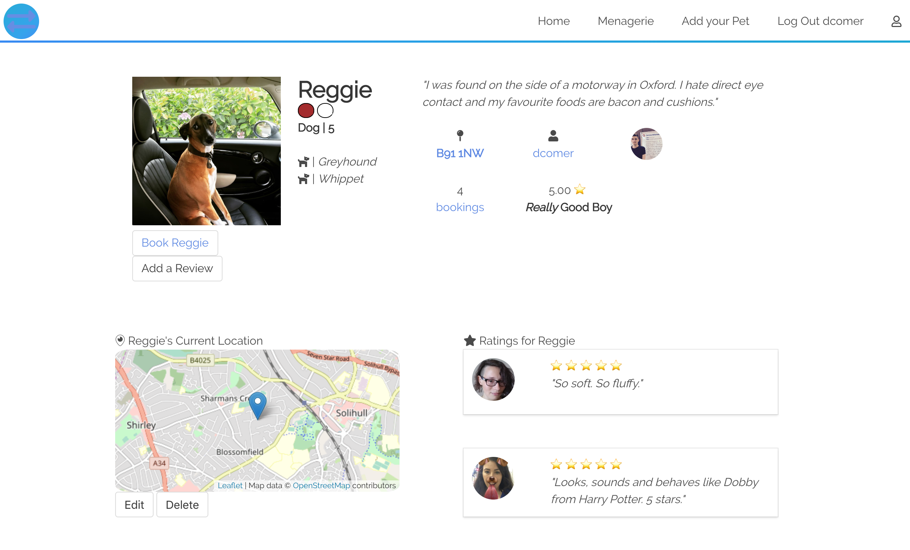
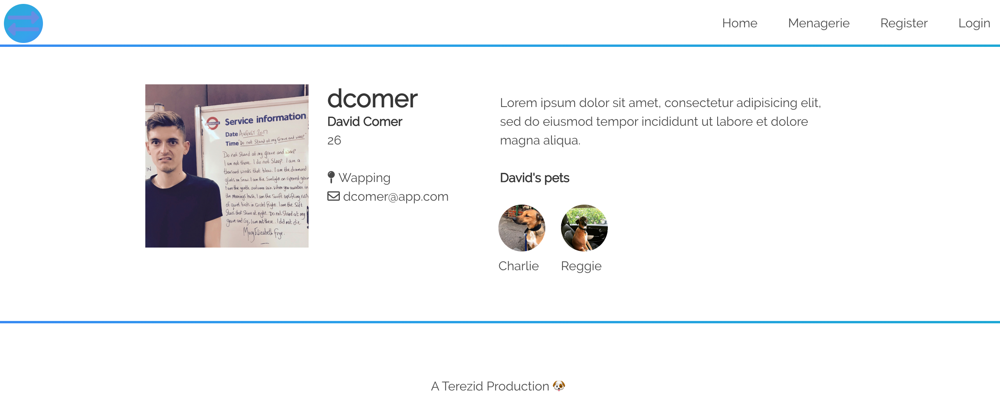

# wdi-project-3

# Ruff Trade

#### General Assembly's Web Development Immersive: Project 3

This MEAN application was built over the course of one week, by a two-person team, consisting of Tereza Kinnertova (https://github.com/terezakinnert) and myself.

## Getting Started

#### [Live version of the app](https://ruff-trade.herokuapp.com/#!/)

#### To run locally

Prerequisites: MongoDB installed and `mongod` running

- clone or download repo
- install dependencies in the same directory: `yarn` (or your package manager's equivalent command)
- `yarn start:server`
- `yarn start:client`, and open `http://localhost:8000/` in your browser if it doesn't launch automatically

## Description

Ruff Trade is an petsitting web app that allows users to arrange to look after pets or have their pets looked after.

Prior to sign-up, the user can only view pets' and owners' profiles.

When authenticated, the user can book pets for specific time slots. When the booking is complete the user can leave reviews. A user can add, edit and remove pets from the app.

### Brief

The project's requirements were as follows:

- [x] Use Mongo, Node & Express to build a server-side API
- [x] Your API must have at least 2 related models, one of which should be a user
- [x] Your API should include all RESTFUL actions for at least one of those models
- [x] Include at least one referenced or embedded sub-document
- [x] Include automated tests for at least one resource
- [x] Use Angular to build a front-end that consumes your API
- [x] Use SCSS instead of CSS
- [x] Use Webpack & Yarn to manage your dependencies and compile your source code

### Tools and Technologies Used

| Back End            | Front End           | Other    |
|----------------------|--------------------|----------|
| Node.js (v10.11.0)   | AngularJS (v1.7.1) | Git |
| Express.js (v4.16.3) | JavaScript (ES6) | GitHub |
| MongoDB (v4.0.2)     | HTML5            | Trello |
| Mongoose (v5.3.12)   | CSS3             | Insomnia |
| bcrypt (v3.0.2)      | SCSS             | Heroku |
| JSON Web Token (v2.1.3) | Bulma         |  |
|                      | Moment.js (v2.22.2)  |   |
|                      | Leaflet.js (v1.3.4)  |   |
|                      | Mocha (v5.2.0)   |   |
|                      | Chai (v4.1.2)    |   |

### APIs Used

- OpenStreetMap

### Trello

Our team used a Trello board to keep track of tasks, progress and blockers. It was very useful to know what the other person is currently working on.

## Page Structure

The Game consists of 3 screens.
1. <strong>Home</strong>  A simple home screen prompting user to sign up in order to access the site.

1. <strong>Login</strong>  A simple login screen prompting user to enter details that feed the User model

1. <strong>Pet Index</strong>  A list of thumbnails representing all available animals in the system. 

1. <strong>Pet Show</strong>  A profile page for each pet - displaying a map of their location, their owner's details, their ratings and their reviews. 

1. <strong>User Show</strong>  A profile page for the user - displaying their contact derails, a bio and a list of their pets. 

## Approach

This was the first project I worked on as part of a group. I was drafted into a team with Tereza.

On our first day, we just mapped out our project session, designing wireframes, models, routes and controllers. We then pair-programmed the back-end to ensure that we has a solid common knowledge of routing and naming conventions.

From there, we used Trello to divide tasks in a way that challenged us in areas that we had previously found tricky. When we were struggling, we used one another as the firs port of call for assistance which worked very well.

## Challenges and Wins

- Working in a team gave use both a profound appreciation for the importance of prior planning. Having allotted a considerable amount of time to to mapping out the project before we began coding, we still had to make considerble adjustments along the way to arrive at the end product we had in mind when we began.

- Lerning to use Git and Insomnia was a really valuable win for me. In particular, Insomnia was a critical tool for problem-solving and saving time, by allowing us to assess with certainty whether our issues were arising in the front- or back-ends.

## Future Work

* Filter animals by distance to logged in users

* Use external API for dog breeds to pull out useful information pfr prospective dog-sitters (ie, recommended diet/exercise/nature etc.)
