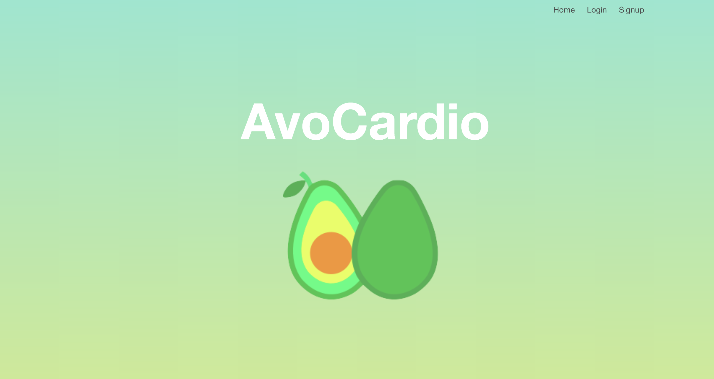

# wdi-project-3
# Avocardio Fitness app
---

## Overview
Avocardio is a fitness app which tracks the caloric input and output of a user.

This was our fourth project as part of the General Assembly Web Development Immersive course. The objective was to build a full stack web application using React.

This was a group project.
---
## Contributors
* David Comer
* Theodora Birch
---
## Timeframe

1 week (December 2018)
---
## Technologies used

* React
* Javascript (ECMAScript6)
* SCSS/Css
* Bulma
* GitHub
* bcrypt
* Mongoose
* Trello
* Node.js
* Express
* Mocha
* Chai

## User Journey

The user begins by either logging in or signing up.



On sign-up, the user inputs the following information:
* Name
* Username
* Email
* Password
* Profile picture
* Age
* Weight
* Height
* Male/Female


This information serves as the basis for the dashboard (user show page) populating many of the fields within.

Once logged in, the user can track their daily meals and workouts workouts on their user show page.

The Meal Show and the Workout Show pages allow users to log meals and workout plans which feed into the calculations for their daily caloric intake and output. This then updates dynamically on the user dashboard.

---

## Approach
Both Theo and I really liked the idea of building quite a personalised app that incorporated lots of dynamic data. We were both excited by the prospect of designing mathematical functions to combine many different data to create fields. Having both used tacking apps like Fitbit & MyFitnessPal before, we reasoned that displaying fields like BMI, calories consumed and calories exerted would allow us to pursue this.

We knew our back-end would complicated from the beginning. We designed five interconnecting models:
* Exercise
```
const exerciseSchema = mongoose.Schema({
  type: String, enum: ['Jogging', 'Cycling', 'Swimming (Freestyle)'],
  intensity: { type: Number, min: 1, max: 23 },
  icon: String
});
```
* Food
```
const foodSchema = mongoose.Schema({
  name: String,
  kCalsPer100g: Number,
  proteinPer100g: Number,
  carbsPer100g: Number,
  fatPer100g: Number,
  image: String
});
```
* Meal - this model referenced the User. The "servings" attributed to each meal were treated as if they were comments on the Food Model.
```
const mealSchema = mongoose.Schema({
  user: {type: mongoose.Schema.ObjectId, ref: 'User'},
  date: Date,
  servings: [{
    food: {type: mongoose.Schema.ObjectId, ref: 'Food'},
    quantity: Number
  }],
  name: {
    type: String, enum: ['Breakfast', 'Lunch', 'Dinner', 'Snack']
  }
});
```
* User
```
const userSchema = mongoose.Schema({
  username: { type: String },
  email: { type: String },
  password: { type: String },
  profilePicture: String,
  forename: { type: String },
  surname: { type: String },
  age: { type: Number },
  sex: {
    type: String, enum: ['Male', 'Female']
  },
  height: { type: Number },
  weight: { type: Number },
  bodyFat: { type: Number}
});
```
* Workout - this referenced the exercise model.
```
const workoutSchema = mongoose.Schema({
  user: { type: mongoose.Schema.ObjectId, ref: 'User'},
  date: Date,
  exercise: {type: mongoose.Schema.ObjectId, ref: 'Exercise'},
  duration: { type: Number, min: 5, max: 600 }
});
```
All these models formed the basis of our back-end of the app. Once these had been established we drew wireframes.


---
## Wins

One of the biggest coding wins that we had was the successful deign of all the virtual fields that populated the user model.

We were able to populate all information on Insomnia first, before displaying on the front-end.


On the back-end, we calculated the base calories that a person is likely to burn in a sedentary state based on their age, height and weight. This was done in a virtual on the back-end. The code for this can be seen below.

Here, "intensity" represents Metabolic Equivalent Task(MET), a unit of measurement commonly used to estimate caloric expenditure. At rest, human beings register an MET of 1

```
workoutSchema.virtual('baseCaloriesBurned')
  .get(function() {

    const mins = 1440;
    const weight = this.user.weight;
    const intensity = 1;

    function baseCaloriesBurned(mins, weight, intensity) {
      const calsBurned = ((intensity * weight) / 60) * mins;
      return calsBurned;
    }
    return baseCaloriesBurned( mins, weight, intensity);
  });
  ```

  We also pulled through the breakdown of the foods eaten in terms of the main food groups - Fats, Proteins and Carbohydrates - these were calculated on the back-end, populated on the user and then render on the front-end:
  ```
  mealSchema.virtual('totalProteins')
    .get(function() {
      return this.servings.reduce((total, serving) =>
        total + (serving.food.proteinPer100g * serving.quantity), 0);
    });

  mealSchema.virtual('totalCarbs')
    .get(function() {
      return this.servings.reduce((total, serving) =>
        total + (serving.food.carbsPer100g * serving.quantity), 0);
    });

  mealSchema.virtual('totalFats')
    .get(function() {
      return this.servings.reduce((total, serving) =>
        total + (serving.food.fatPer100g * serving.quantity), 0);
    });
```
---
## Challenges

By far the biggest challenge that we faced during this project was our ambition. We were both genuinely so excited by the prospect of this project that we underappreciated the accumulative effect on our workload that having five interconnected models would have. Having created such a complex back-end, we did not properly understand how much time it would realistically take to to complete the project. As a result, we devoted a lot of time to perfecting the back-end to the detriment of our front-end aesthetic.


## Future features

If we had more time we would have developed the front-end better by using chart.js to display the data. We would also use an external API to pull the caloric information of food that is uploaded.
